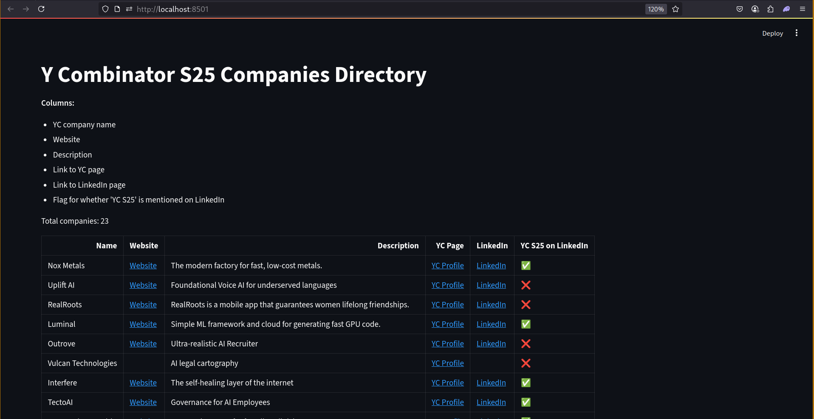

# YC S25 Companies Real-Time Parser & Explorer

This project scrapes all companies from the [Y Combinator Companies Directory](https://www.ycombinator.com/companies) for the **2025 batches** (Summer, Spring, Winter), enriches the data with LinkedIn information, and displays it in an interactive Streamlit app.

## Important Notes & Clarifications

- **"Real-Time" Data Parser:**
  - The project was described as a “real-time parser” in the task, but since the YC directory doesn’t offer real-time APIs, push updates, or streaming mechanisms, there’s no need for WebSockets, Server-Sent Events (SSR), or persistent polling in this case. Instead, I’ve implemented a straightforward setup using Selenium and BeautifulSoup to fetch the latest available data on demand. If you’d prefer a different approach or have any specific requirements in mind, I’d be happy to adapt the implementation accordingly.

- **Batch Inclusion Criteria:**
  - Only companies explicitly tagged as **S25** (i.e., "Summer 2025", "Spring 2025", or "Winter 2025") are included in the dataset. Companies with other tags such as **X25** are **not** included, as per the project requirements.

## Features
- **Automated scraping** of all YC companies in the 2025 batches (S25) using Selenium (handles scroll).
- **Enrichment**: For each company, attempts to find and parse its LinkedIn page, flagging if "YC S25" is mentioned in the description.
- **Data cleaning and deduplication**.
- **Interactive Streamlit app** to explore the data: company name, website, description, links, and LinkedIn flag.

## Requirements
- Python 3.10+
- A browser (Either Firefox or Chrome)
- All Python dependencies in `requirements.txt`

## Installation
1. **Clone the repository** (or copy the project files):
   ```bash
   git clone https://github.com/0saurabh0/YC-scp.git
   cd yc-scp
   ```
2. **Create and activate a virtual environment** (recommended):
   ```bash
   python -m venv venv
   source venv/bin/activate
   ```
3. **Install dependencies:**
   ```bash
   pip install -r requirements.txt
   ```

## Usage

### 1. Run the Scraper
```bash
python yc_s25_scraper.py
```

This will:
- Open the YC companies page in a headless Firefox browser
- Scroll to load all companies
- Parse company name, description, batch, website, and LinkedIn link
- Enrich with LinkedIn data
- Save results to `yc_s25_companies.csv`


> **Note:** The first run may take several minutes, depending on your internet speed and the number of companies. 
---
- **You can cancel the process at any time, as long as some data has already been written to the .csv file. You can then verify all the details by visiting the Streamlit URL.**

### 2. Run the Streamlit App
```bash
streamlit run streamlit_app.py
```
This will launch a web app to explore the data:


- Open the provided local URL in your browser to view the interactive table.

## Project Structure

```
yc-scp/
├── yc_s25_scraper.py      # Main scraper and enrichment script
├── streamlit_app.py       # Streamlit app for data exploration
├── requirements.txt       # Python dependencies
├── yc_s25_companies.csv   # Output data (generated after scraping)
└── README.md              # This file
```

## Screenshot



*Example: Interactive YC S25 Companies Explorer*
